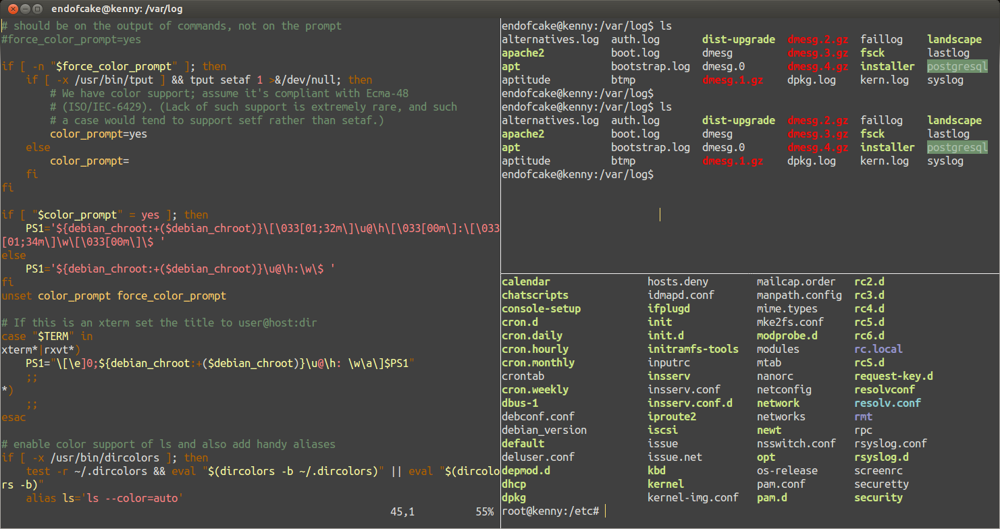

# Zenburn(esque) Terminator colour theme
=======================

A colour theme inspired by Zenburnesque colour theme for Sublime Text.

## Installation

### If you don't have a config file for Terminator

1. Create a config directory for Terminator if one doesn't exist already:

    # mkdir -p ~/.config/terminator/

2. Clone this repository:

    # git clone git@github.com:endofcake/terminator-zenburnesque.git

3. Copy the config file:

    # cp terminator-zenburnesque/config ~/.config/terminator/

### If you already have a config file for Terminator

Copy this profile section to it:
    [[zenburn]]
        scrollbar_position = hidden
        palette = "#53dccd:#ff8080:#22c0ff:#ffcc66:#6f906c:#ffffa0:#ffcc66:#acc1ac:#000000:#ed0b0b:#9393cc:#ff5cbf:#cae682:#5c80ff:#8acccf:#56ed0b"
        cursor_shape = ibeam
        use_system_font = False
        cursor_color = "#ffdf6c"
        foreground_color = "#dededb"
        show_titlebar = False
        font = Ubuntu Mono 14
        background_color = "#404040"
        scrollback_infinite = True

### Useful shortcuts
Alt + A --- broadcast commands to all Terminator panes
Alt + G --- broadcast commands to all panse in a selected group
Alt + C --- stop broadcasting commands

### Screenshot

